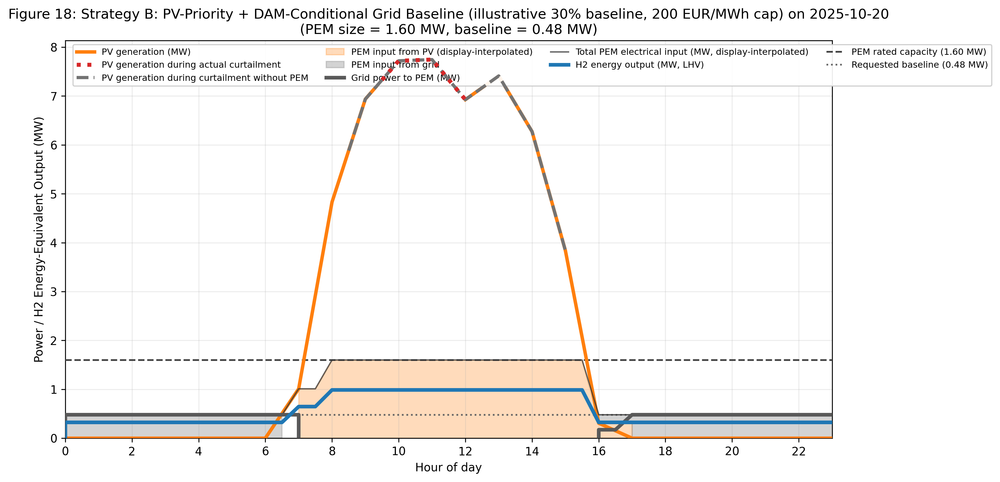
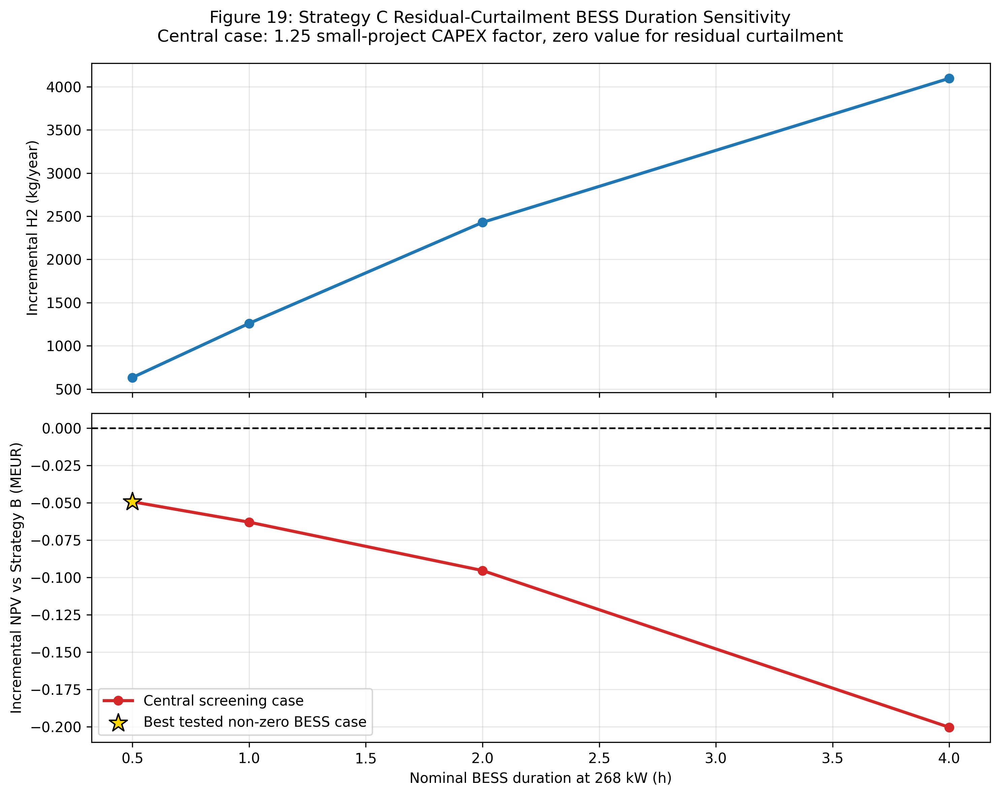

# PV-to-Hydrogen Curtailment Screening in Cyprus

Release target: **v1.9.1-final-screening**.

This portfolio model compares curtailed-PV electrolysis, PV-priority operation
with conditional grid support, and a small battery supplying a fixed **1.60 MW
PEM**. It combines hourly PV inputs, observed Cyprus DAM prices, load-dependent
PEM performance and incremental investment economics.

All three central A/B/C cases have **negative NPV at 7 EUR/kg H2**. The battery
adds hydrogen but does not add economic value. Increasing grid-supported load
is physically feasible in the model and economically worse in the central case.

Read the [final report](docs/FINAL_SCREENING_REPORT.md) for methodology, results
and limitations. Numeric results are in
[final_screening_summary.csv](results/tables/final_screening_summary.csv).
This is a portfolio screening study, not a bankable feasibility assessment.

## Strategies and release changes

| Case | Dispatch | Interpretation |
|---|---|---|
| A | Otherwise-curtailed PV only | No purchased electricity or lost PV exports |
| B | PV first, grid top-up below an all-in price cap | Exportable PV has opportunity cost; import-service costs are explicit |
| C | B plus residual-curtailment-only battery charging | Discharge to PEM only, without grid charging or battery export |

PEM rating is 1.60 MW, minimum load 15%, export limit 6 MW and PV size 10 MWp.
The fine size sweep is a diagnostic, not a replacement for the reporting design.
Site: 35.141 N, 33.415 E, 142 m, PVGIS-SARAH3.

- Renamed the battery CSV to strategy_c_bess_best_nonzero_case.csv with
  Overall economic choice = No BESS and Value adding = NO for this run.
- Added a short report generated from the same result records as the CSVs.
- Refined the Strategy B cap sweep and added a **30% / 0.48 MW** baseline
  comparator at 200 EUR/MWh. Original 20%/200 comparator remains available.
- Updated the regulated network benchmark from 24.70 to **24.50 EUR/MWh** using
  CERA 105/2026 as corrected by 117/2026. Total central adder: **42.51 EUR/MWh**.
- Added low/central/high commercial-cost sensitivity and a PV-priority reference
  without grid import service, demand charges or fixed supply charges.
- Corrected daily Strategy B totals for 0.5-hour energy integration and removed
  annualization from observed daily H2.
- Published eight selected figures, the short report and three final summary
  CSVs. Full sensitivity and diagnostic tables are generated locally by the
  model and are outside the tracked release.
- Replaced UTF-16 dependencies with UTF-8 requirements and included the EES
  performance map. The raw DAM workbook is a user-supplied local input.

## Reproduction

Use Python 3.10 or newer:

~~~bash
python -m pip install -r requirements.txt
python main.py
python verify_release.py
~~~

For unattended execution set MPLBACKEND=Agg. Windows PowerShell:

~~~powershell
py -m pip install -r requirements.txt
$env:MPLBACKEND = "Agg"
py main.py
py verify_release.py
~~~

Default PV source is PVSYST. Set PV_DATA_SOURCE=PVGIS for a source sensitivity.
That overwrites generated results; release verification is tied to PVSYST.

The tracked tables are `final_screening_summary.csv`,
`strategy_b_reporting_cases.csv` and `strategy_c_bess_best_nonzero_case.csv`.
Other tables mentioned below and in the report are generated by `main.py`.
Run the model with the local DAM workbook before running verification.

Included inputs:

~~~text
data/PVGIS_2023.csv
data/PVsyst_TMY_5.3.csv
ees/PEM_EES_performance_map.csv
~~~

Before running, place the original DAM workbook at
`data/DSMK_DAM_2025-10-01_to_2026-09-24.xlsx`. It is not redistributed in this
repository. Use the `DAM_Data` sheet with `Timestamp` and `DAM_Price_EUR_per_MWh`
columns and the coverage stated below. `data/input_manifest.json` records the
SHA-256 of the exact workbook used for the published results. Both the model
and verification require this local input.

Raw net PVsyst E_Grid is 19,174.158 MWh/year. Clipping negative values gives
19,174.592 MWh/year. The recovered model also interpolates four isolated daytime
values, adding 23.682 MWh/year to give 19,198.274 MWh/year prepared dispatch PV.
This is an unconfirmed preprocessing assumption, not measured generation.
pvsyst_source_repairs.csv identifies the affected records and
pvsyst_preparation_sensitivity.csv compares A/B with no interpolation. Original
input files are unchanged. Night consumption is not added to project costs.

DAM coverage is 17,230 half-hour observations over 359 days, annualized by
365/359. Absent spring clock-change intervals are not filled. TMY weather and
observed prices are not a historically coincident year. Clock alignment and
within-hour PV variability remain approximations.

The EES loader accepts original EES headings and percentage load labels.
docs/EES_PEM_Model_v2.7.EES is preserved as an earlier reference; this release
uses the supplied CSV and does not claim that the old EES file reproduces it.

## Performance and financial assumptions

Primary H2 uses the **Tran system SEC curve**, covering 25-100% load with an
explicitly extrapolated 15% point. EES gross-stack SEC is a boundary sensitivity,
and EES voltage supports degradation comparators. Cross-checking implementations
is not experimental validation.

| Assumption | Central value | Status |
|---|---:|---|
| PEM installed CAPEX | 1,970 EUR/kW, 3.152 MEUR total | Published benchmark, no quotation |
| Fixed PEM OPEX | 3% of CAPEX/year | Assumption |
| Horizon / real discount rate | 15 years / 8% | Assumptions |
| H2 price | 7 EUR/kg | Unsecured offtake assumption |
| Water use | 10 L/kg H2 | Plant-water comparator, no treatment design |
| Exportable-PV value | 107.30-107.96 EUR/MWh monthly | Supplied EAC 11 kV proxy, no actual PPA |
| Import demand charge | 25 EUR/kW-year | Contract-specific assumption |
| Fixed import supply/metering | 3,000 EUR/year | Contract-specific assumption |

Beginning-of-life LCOH uses annualized CAPEX plus annual operating, energy and
opportunity costs divided by annual H2. NPV subtracts initial CAPEX once and
discounts net cash flow. Lifecycle metrics add replacements and degraded H2.

These are incremental PEM/BESS economics. Full PV CAPEX, tax, debt, compression,
bulk storage, transport, dispensing and water treatment/purchase costs are
excluded. VAT is assumed recoverable.

## Strategy B and requested grid support

Minimum LCOH is selected among tested caps at the **fixed 20% baseline and
central import-service terms**. The refined sweep identifies 75 EUR/MWh, with
identical dispatch at nearby low caps, about 0.476 MWh/year import, 8.099 EUR/kg
LCOH and -1.014 MEUR NPV. This is a conditional numerical minimum, not a unique
continuously optimized policy.

The raised **30% / 200 EUR/MWh** comparator imports about **82.94 MWh/year**,
produces **109,506 kg H2/year**, and has **8.157 EUR/kg LCOH** and **-1.084 MEUR
NPV**. It shows additional grid use within the 1.60 MW rating, not better economics.

PV-priority operation **without import service** produces about 107,808 kg/year
at 7.998 EUR/kg and -0.920 MEUR NPV. It avoids import demand/fixed charges and
is distinct from curtailment-only A because it uses exportable PV.

strategy_b_reporting_cases.csv retains these cases and the original 20%/200
comparator. strategy_b_market_cost_sensitivity.csv tests the existing low,
central and high commercial assumptions.

| Add-on above DAM | EUR/MWh | Basis |
|---|---:|---|
| Supplier/aggregator margin | 5.00 | Assumption |
| Imbalance allowance | 7.50 | Assumption |
| MV network/system | 24.50 | CERA 2026, 9.90 + 12.10 + 2.50 + 0.00 |
| PSO | 0.51 | EAC published fee |
| RES/energy-efficiency fund | 5.00 | EAC fee comparator |
| **Total** | **42.51** | Calculated screening value |

The 2026 network benchmark applies across the window as a scenario, not
historical invoicing. Zero regulated ancillary-services tariff does not remove
imbalance or market-settlement exposure. Take-or-pay is assumed absent,
half-hour interruption allowed and collateral financing zero. Lower commercial
assumptions are sensitivities, not verified supplier offers.

## Battery and lifecycle limitations

C tests 268 kW at 0.5/1/2/4 hours and a public Huawei technical comparator.
The best central non-zero duration case is **268 kW / 134 kWh**, adding about
**632 kg H2/year** with incremental NPV **-49,303 EUR**. Overall choice: **No BESS**.

Battery physics include losses, SOC bounds, cyclic SOC and minimum PEM load.
Costs use EUR2020 catalogue coefficients and a small-project factor. Escalation,
capacity fade, detailed HVAC and replacement costs are omitted, making the
battery result an optimistic screening comparison with mixed cost years.

Stack sensitivity covers 7, 23 and 50 microV/h. **23 and 50 microV/h are linear
stress tests, not validated MW-scale lifetime forecasts.** EOL is the first of
30,000 hours or 10% voltage/SEC rise. Replacement resets only the stack. Terminal
retirement is a modeling rule, not an optimized replacement policy. BoP ageing
is unquantified. OEM calibration, actual tariffs, installed quotations and H2
handling/offtake evidence are required for a commercial assessment.

## Figures and verification

Eight figures are tracked: monthly PV comparison (1), multi-objective sizing
(5), recovery (7), B LCOH/NPV sensitivity (14/15), A/B dispatch (17/18) and BESS
duration (19). Full diagnostics are still generated locally; .gitignore keeps
unselected outputs outside the release.

verify_release.py checks coverage, accounting identities, conditional selection,
the zero-import-service reference, battery cash flows and nine lifecycle cases.
This verifies internal consistency, not experimental accuracy.
See [verification result](results/verification.txt).

## Sources

- [TSOC DAM exports](https://tsoc.org.cy/competitive-electricity-market/dam-volume-prices-graph/)
- [CERA 105/2026, including correction 117/2026](https://www.cera.org.cy/el-gr/apofasis/details/apofasi-105-2026)
- [EAC PSO fee](https://pilot.eac.com.cy/en/supply/for-the-house/electricity-tariffs/ypochreoseis-paroches-demosias-yperesias-y-p-d-y/)
- [EAC bill charges](https://pilot.eac.com.cy/en/supply/commercial-and-industrial/my-account/commercial-account-explanation/)
- [European Hydrogen Observatory costs](https://observatory.clean-hydrogen.europa.eu/hydrogen-landscape/production-trade-and-cost/electrolyser-cost)
- [Danish Energy Agency data](https://ens.dk/technologydata)
- Tran et al. (2026), *Hydrogen production system scaling using a high-fidelity simulation-optimization framework*, Energy Conversion and Management 357, 121416, Table 6.
- [Arnold et al. (2025), replacements](https://doi.org/10.1016/j.ecmx.2025.101261)
- [Zerrougui, Li and Hissel (2025), lifetime](https://doi.org/10.1016/j.ijhydene.2025.152297)
- [Sayed-Ahmed et al. (2024), dynamic operation](https://doi.org/10.1016/j.rser.2023.113883)

The assumptions register and OEM comparison CSVs record evidence classes.
Public OEM comparators are not project quotations.

